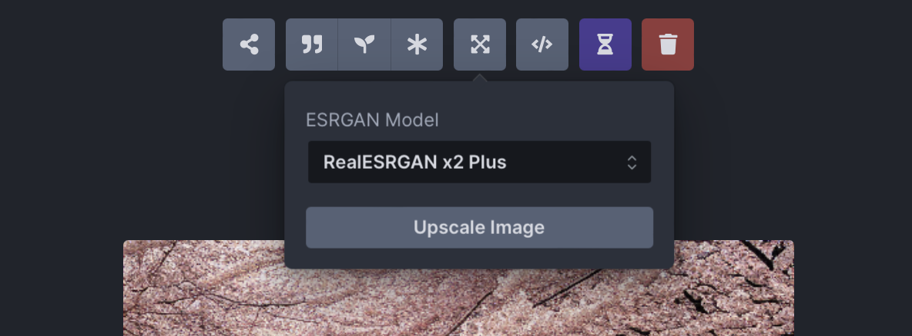

# :material-image-edit: Postprocessing

This sections details the ability to improve faces and upscale images.

## Face Fixing

As of RevokeAI 3.0, the easiest way to improve faces created during image generation is through the Inpainting functionality of the Unified Canvas. Simply add the image containing the faces that you would like to improve to the canvas, mask the face to be improved and run the invocation. For best results, make sure to use an inpainting specific model; these are usually identified by the "-inpainting" term in the model name. 

## Upscaling

Open the upscaling dialog by clicking on the "expand" icon located
above the image display area in the Web UI:

<figure markdown>

</figure>

The default upscaling option is Real-ESRGAN x2 Plus, which will scale your image by a factor of two. This means upscaling a 512x512 image will result in a new 1024x1024 image.

Other options are the x4 upscalers, which will scale your image by a factor of 4. 

!!! note

    Real-ESRGAN is memory intensive. In order to avoid crashes and memory overloads
    during the Stable Diffusion process, these effects are applied after Stable Diffusion has completed
    its work.

    In single image generations, you will see the output right away but when you are using multiple
    iterations, the images will first be generated and then upscaled after that
    process is complete. While the image generation is taking place, you will still be able to preview
    the base images.

## How to disable

If, for some reason, you do not wish to load the ESRGAN libraries,
you can disable them on the revoke.py command line with the `--no_esrgan` options.
